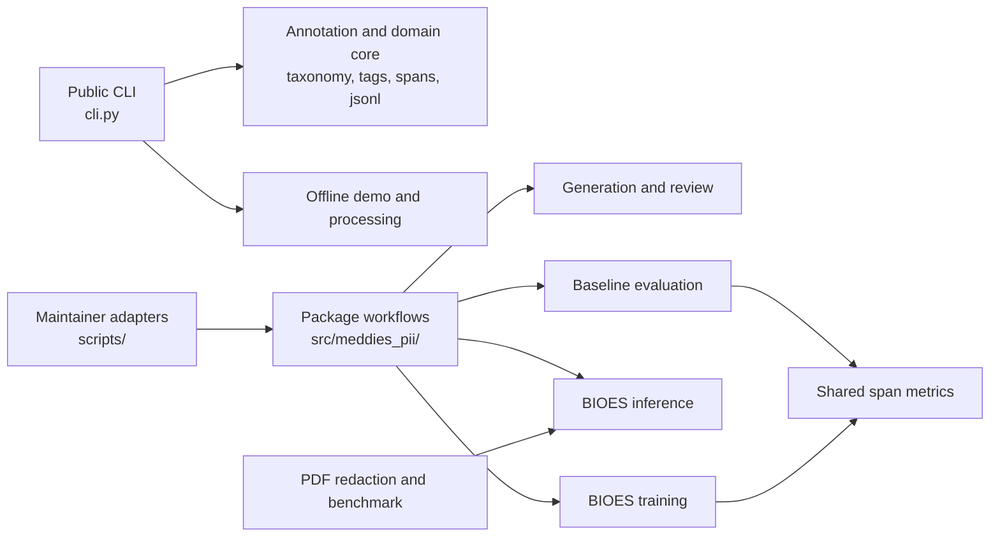

# Architecture

Meddies PII is a Python package for inline-tagged clinical PII examples, dataset preparation, model evaluation, and PDF-redaction benchmarking. The public contributor path starts with the offline `meddies-pii` command. Maintainer jobs live in `scripts/` and call package code.

## Find the right layer

Dependency direction is inward. `cli.py` and `scripts/` adapt inputs, environments, and process output. Reusable behavior belongs below `src/meddies_pii/`; package workflows share the annotation core, BIOES inference, and evaluation metrics, not CLI or script code. Tests exercise package behavior under `tests/`.

| Area | Owns | Start here |
| --- | --- | --- |
| Annotation core | The nine Meddies Labels, inline-tag parsing and validation, character spans, BIOES encoding, JSONL helpers | `src/meddies_pii/taxonomy.py`, `annotations/`, `spans.py`, `tags.py`, `jsonl.py` |
| Public interface | Offline commands and advanced-workflow argument handling | `src/meddies_pii/cli.py` |
| Data generation and review | Synthetic label-corpus policies, OpenAI-compatible providers, Gemini batch review, correction | `src/meddies_pii/generation/` |
| Data preparation and training | BIOES data assembly, quality checks, reports, and training adapters | `src/meddies_pii/training/bioes/` |
| BIOES inference | Pinned artifacts, verified hydration and staging, detector contracts, ONNX and OpenVINO CPU backends | `src/meddies_pii/bioes_inference/` |
| Baseline evaluation | Shared baseline harness, model adapters, Regex release, OPF benchmark, PII350 release | `src/meddies_pii/eval_baseline/{baseline,adapters,regex_release,opf_benchmark,pii350_release}/`, `src/meddies_pii/evaluation/span_metrics.py` |
| PDF redaction | Document extraction, OCR, PII regions, writers, verification, benchmark matrix | `src/meddies_pii/pdf_redaction/` |
| Publishing | Explicit Hugging Face dataset helpers | `src/meddies_pii/publishing/` |
| Maintainer operations | Modal launchers, migration utilities, report renderers, archived one-offs | `scripts/` |

`scripts/` is not an implementation layer. Put reusable parsing, validation, policy, scoring, or data transformation in the package first. Keep a script as a thin executable adapter. See [`scripts/README.md`](../scripts/README.md) for the maintainer-script directory guide.

## Shared runtime seams

Platform-sensitive coordination and process measurements live behind small
package modules rather than being reimplemented in individual workflows:

- `file_locks.py` provides stable exclusive locks on both POSIX and Windows;
- `runtime_memory.py` provides peak/current resident-memory measurements with
  procfs, `resource`, and Windows fallbacks.

These modules keep benchmark and cache behavior identical while allowing the
package and its tests to be imported on a contributor's operating system.

## Runtime boundaries

| Boundary | What runs there | Data and credential rule |
| --- | --- | --- |
| Local contributor machine | `meddies-pii labels`, `validate`, and `demo`; unit tests; lint; type checks; package build | The offline path needs no credentials or network access. `.env.example` lists credentials for advanced workflows. |
| Provider and hosted-data workflows | Generation, correction, Gemini review, Hugging Face publishing or reads | The invoking workflow makes its provider or hosted-data dependency explicit. Do not add network work to offline CLI commands. |
| Modal | Declared BIOES-training, baseline-evaluation, and benchmark entrypoints under `scripts/ops/` and `training/bioes/modal/` | Each entrypoint declares its image, secret, source mount, and persistent Volume. Launching a Modal entrypoint is an operator action, not a test command. |
| PDF private-fixture benchmark | The `private_fixture` entrypoint in `scripts/ops/run_pdf_redaction_benchmark.py` | Input and output use a temporary remote workspace; the returned result is unreviewed. The recorded metadata contains hashes, counts, timings, and reason codes. |

## Evaluation identities are complete and enforced

Each baseline shard has an `EvaluationContract` and a `DatasetShardIdentity`. The evaluation contract records immutable identities for the model artifact, vendor inference source, local adapter source, applied-label prediction contract, decoder contract, resolved runtime environment, scorer contract, supported labels, and result schema. The dataset shard identity records the evaluation contract with its dataset, shard, fixture rows, and row count.

`run_shard` persists the evaluation contract and dataset shard identity, with their digests, in shard metadata. When it reuses a completed shard or reads matrix results, the evaluation runner accepts a result only when its persisted identity matches the expected contract and materialized fixture. Missing, malformed, stale, or mismatched metadata is excluded from aggregation. Dataset loaders still pin their Hugging Face revisions, and corpus manifests record stable-input hashes and report drift. Keep exact and containment span metrics distinct.

## Extension recipes

### Add a model adapter

1. Create `src/meddies_pii/eval_baseline/adapters/<model>.py` that satisfies `PiiAdapter`: `name`, `supported_labels`, `load()`, and `predict(texts)`.
2. Convert every prediction to validated `CharSpan` offsets in the original input text. Do not invent a label outside `PiiLabel`.
3. Add focused tests under `tests/eval_baseline/adapters/`. Cover supported-label filtering, invalid offsets, and a prediction-count mismatch.
4. Wire an explicit maintainer runner only when the adapter needs one. Reuse `run_shard` so the JSONL result, completion marker, fixture digest, and timing sidecar follow the existing contract.

### Add an evaluation dataset

1. Add a pinned source revision and canonical dataset key in `eval_baseline/baseline/datasets.py`.
2. Convert external records through `row_from_record` or an equally strict adapter. Require non-empty text, valid offsets, a canonical language, and Meddies Labels.
3. Add the dataset to `EVAL_DATASETS` and its frozen count to `EVAL_EXPECTED_ROWS` only after a deliberate fixture decision.
4. Test the parser and a negative record. Do not treat a new source as comparable until its revision, split, labels, and expected count are recorded.

### Add a scorer

1. Put a reusable span metric in `src/meddies_pii/evaluation/span_metrics.py`.
2. Add it to `score_reports` only when every baseline consumer should emit it. Otherwise keep the metric in the owning evaluation workflow.
3. Add direct tests for no spans, false positives, false negatives, label mismatch, and the intended boundary semantics.
4. State whether the scorer is exact, containment, or another explicitly defined relation. Do not compare numbers across different relations.

## Verification map

| Check | Command or trigger | What it proves |
| --- | --- | --- |
| Lockfile consistency | `uv lock --check` | `uv.lock` matches dependency declarations. |
| Locked dependency audit | `uv audit --locked` | The locked dependency graph is checked against the audit source at run time. |
| Lint | `uv run ruff check --config ruff-strict.toml .` | The configured Ruff rules pass. |
| Behavior | `uv run pytest` | The active test suite passes. |
| Types | `uv run mypy src/meddies_pii` and `uv run basedpyright src/meddies_pii` | Active package source satisfies the configured type gates. |
| Package | `uv build --out-dir dist` | Distributions build from the checked-out source. |
| Quality CI | `.github/workflows/quality.yml` on pull requests and pushes to `main` | The quality workflow runs the lock, lint, test, coverage, type, build, and package checks. |
| Security CI | `.github/workflows/security.yml` on pull requests, pushes to `main`, and weekly schedule | The security workflow owns `uv audit --locked` and runs Bandit against `src/meddies_pii` and `scripts/` at high severity and confidence. |
| Evaluation artifact integrity | `tests/eval_baseline/baseline/test_run_timing.py` and `tests/eval_baseline/baseline/test_aggregate.py`; `read_matrix_results` at runtime | Shard outputs must agree with their fixture digest and expected row count before aggregation. |
| Corpus input drift | `tests/bioes/test_corpus_manifest.py`; `verify_manifest` for a materialized corpus | Recorded stable-file hashes are recomputed and mismatches are reported. |

The checks above do not replace a real remote run. In particular, this repository configuration does not prove that the Security workflow's locked dependency audit or Bandit scan, Dependabot, a provider workflow, or a Modal job has run until GitHub or Modal records that run.

## Orientation path

Read these in order when joining the project:

1. [README](../README.md) for the offline quick start and Meddies Labels.
2. [`cli.py`](../src/meddies_pii/cli.py) for public command ownership.
3. [`taxonomy.py`](../src/meddies_pii/taxonomy.py) and [`spans.py`](../src/meddies_pii/spans.py) for the core data contract.
4. [`eval_baseline/baseline/run.py`](../src/meddies_pii/eval_baseline/baseline/run.py) for current fixture checks and scoring flow.
5. [`CONTRIBUTING.md`](../CONTRIBUTING.md) before changing behavior or launching advanced workflows.
